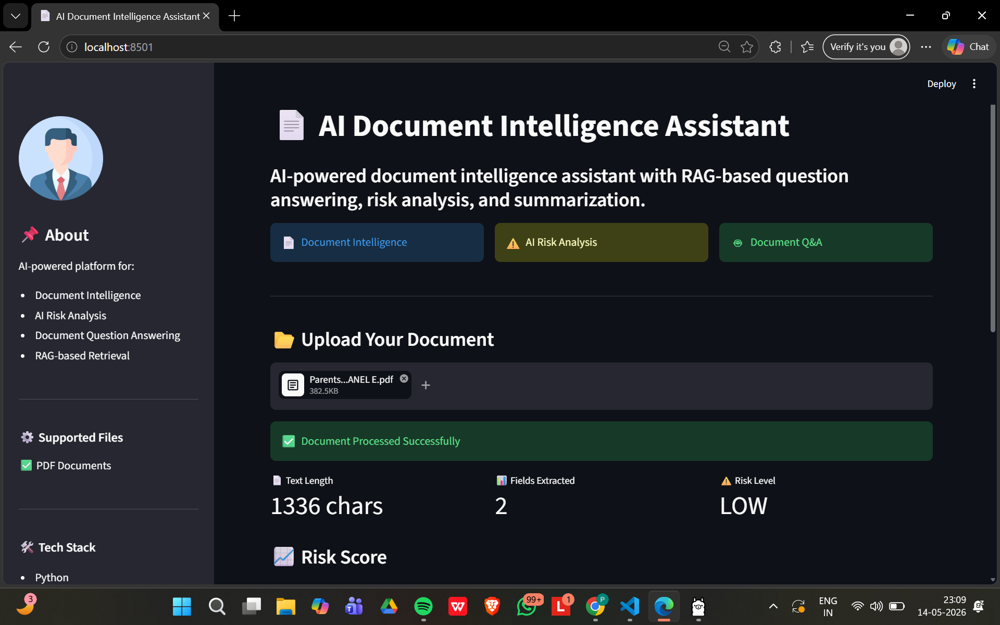
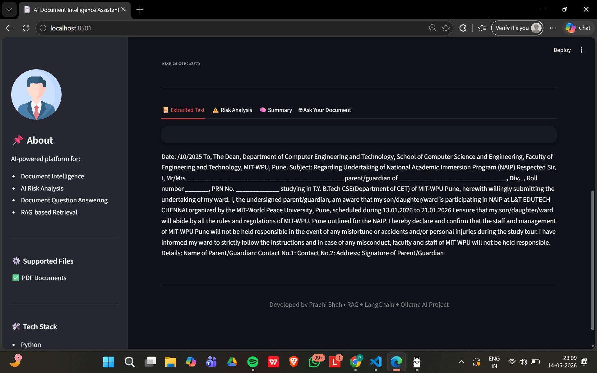
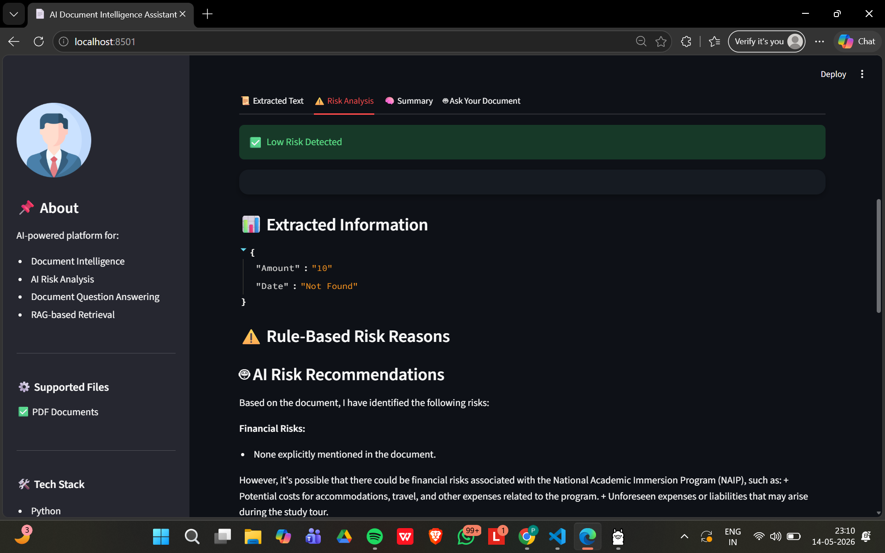
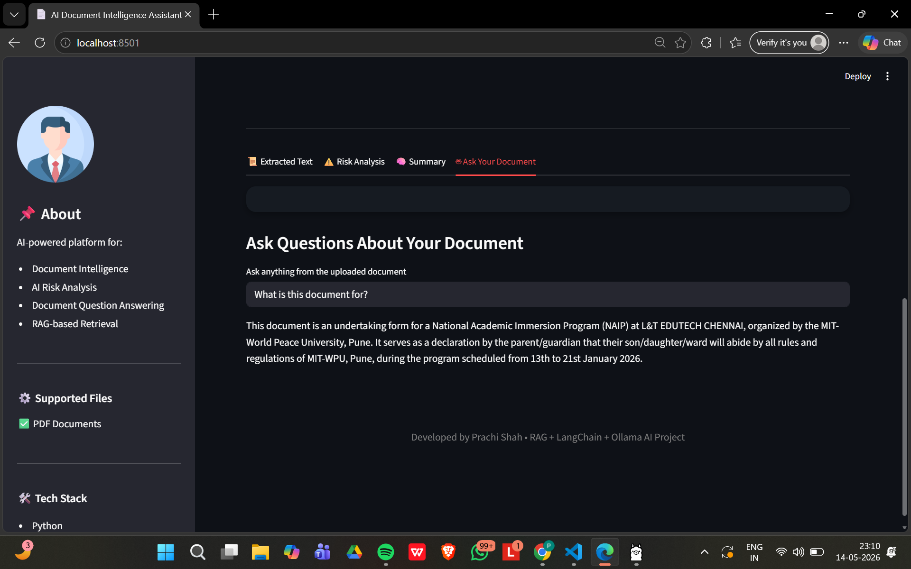

# 📄 AI Document Intelligence Assistant

<p align="center">
  
  
  
  
  
</p>

---

# 🚀 Overview

AI Document Intelligence Assistant is an AI-powered web application that enables intelligent document understanding using Retrieval-Augmented Generation (RAG), Large Language Models (LLMs), and NLP.

Users can upload PDF documents, analyze risks, generate summaries, and ask contextual questions directly from document content.

This project demonstrates practical implementation of:

- Artificial Intelligence
- Natural Language Processing (NLP)
- Retrieval-Augmented Generation (RAG)
- Large Language Models (LLMs)
- Semantic Search
- Vector Databases
- Streamlit Dashboard Development
- Document Intelligence Systems

---

# ✨ Features

✅ Upload and analyze PDF documents  
✅ Automatic text extraction  
✅ AI-powered document summarization  
✅ Intelligent risk analysis  
✅ Context-aware document question answering  
✅ Retrieval-Augmented Generation (RAG)  
✅ Vector similarity search using ChromaDB  
✅ Local LLM inference using Ollama + Llama 3  
✅ Interactive dashboard UI  
✅ Risk score visualization  
✅ Download generated summary  
✅ Dark professional UI theme  

---

# 🛠️ Tech Stack

| Technology | Purpose |
|----------|---------|
| Python | Core Programming |
| Streamlit | Frontend Dashboard |
| LangChain | AI Orchestration |
| ChromaDB | Vector Database |
| Ollama | Local LLM Runtime |
| Llama 3 | Large Language Model |
| NLP | Text Understanding |
| PyPDF2 | PDF Text Extraction |

---

# 🏗️ System Workflow

```text
User Uploads PDF
        ↓
Text Extraction
        ↓
Document Chunking
        ↓
Vector Embedding Generation
        ↓
Chroma Vector Database
        ↓
Semantic Retrieval
        ↓
Llama 3 Reasoning
        ↓
Risk Analysis / Q&A / Summarization
        ↓
Interactive Dashboard
```

---

# 📂 Project Structure

```bash
doc-risk-analyzer/
│
├── app.py
├── utils.py
├── rag_utils.py
├── requirements.txt
├── README.md
├── screenshots/
│   ├── homepage.png
│   ├── dashboard.png
│
├── uploads/
├── assets/
└── venv/
```

---

## 📸 Application Screenshots

## 🏠 Home Page



---

## 📊 Dashboard Overview



---

## ⚠️ AI Risk Analysis



---

## 🤖 Document Q&A Assistant


---

# ⚙️ Installation Guide

## 1️⃣ Clone Repository

```bash
git clone https://github.com/prachi-shah07/doc-risk-analyzer.git
```

---

## 2️⃣ Move into Project Folder

```bash
cd doc-risk-analyzer
```

---

## 3️⃣ Open in VS Code

```bash
code .
```

---

## 4️⃣ Create Virtual Environment

### Windows

```bash
python -m venv venv
```

Activate:

```bash
.\venv\Scripts\activate
```

---

### Mac/Linux

```bash
python3 -m venv venv
```

Activate:

```bash
source venv/bin/activate
```

---

## 5️⃣ Install Dependencies

```bash
pip install -r requirements.txt
```

---

## 6️⃣ Install Ollama

Download:

https://ollama.com/download

Install the LLM model:

```bash
ollama pull llama3
```

---

## 7️⃣ Run Application

```bash
streamlit run app.py
```

---

## 8️⃣ Open Browser

```text
http://localhost:8501
```

---

# 🧠 NLP + AI Features Used

This project uses advanced NLP techniques including:

- PDF text extraction
- Document parsing
- Semantic chunking
- Context-aware retrieval
- Embedding generation
- Similarity search
- LLM-based reasoning
- AI summarization
- Question answering
- Risk analysis

---

# ⚠️ Risk Analysis Capabilities

The assistant identifies potential:

- Financial Risks
- Legal Risks
- Compliance Risks
- Privacy Concerns
- Contractual Issues

Risk insights include mitigation recommendations.

---

# 🤖 Sample Questions

Try asking:

- Summarize this document
- What are the key obligations?
- Are there any financial risks?
- What compliance concerns exist?
- Are there privacy issues?
- Suggest mitigation strategies
- What important clauses are present?

---

# 📊 Dashboard Features

Dashboard provides:

- Extracted text metrics
- Risk score visualization
- AI-generated summaries
- Structured field extraction
- AI-powered risk analysis
- Interactive Q&A tab
- Downloadable summaries
- Tab-based document exploration

---

# 🔮 Future Enhancements

- DOCX support
- OCR for scanned PDFs
- Multi-document querying
- Cloud deployment
- Authentication system
- Multi-agent workflows
- AI report export
- Role-based access control

---

# 🛠️ Common Errors & Solutions

## ❌ Ollama not recognized

Restart terminal / VS Code after installation.

Or run:

```bash
"C:\Program Files\Ollama\ollama.exe" run llama3
```

---

## ❌ Streamlit not recognized

```bash
pip install streamlit
```

---

## ❌ Port already in use

```bash
streamlit run app.py --server.port 8502
```

---

# 🧾 Git Commands

```bash
git add .
git commit -m "Upgraded project to RAG-based AI document assistant"
git push origin main
```

---

# 📚 Learning Outcomes

Through this project, I learned:

- RAG architecture
- LangChain workflows
- Local LLM integration
- Vector databases
- Semantic retrieval
- AI document intelligence
- NLP applications
- Streamlit dashboard engineering
- Git/GitHub collaboration

---

# 👩‍💻 Author

## Prachi Shah

B.Tech Computer Science Engineering  
MIT-WPU Pune

GitHub:  
https://github.com/prachi-shah07

---

# 📄 License

Developed for:

- Educational purposes
- Portfolio showcase
- AI/NLP learning
- Generative AI experimentation

---

# ⭐ Conclusion

AI Document Intelligence Assistant combines NLP, RAG, vector search, and local LLM reasoning to transform traditional document analysis into an interactive AI-powered experience.